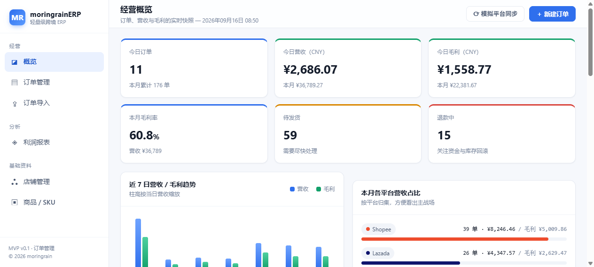
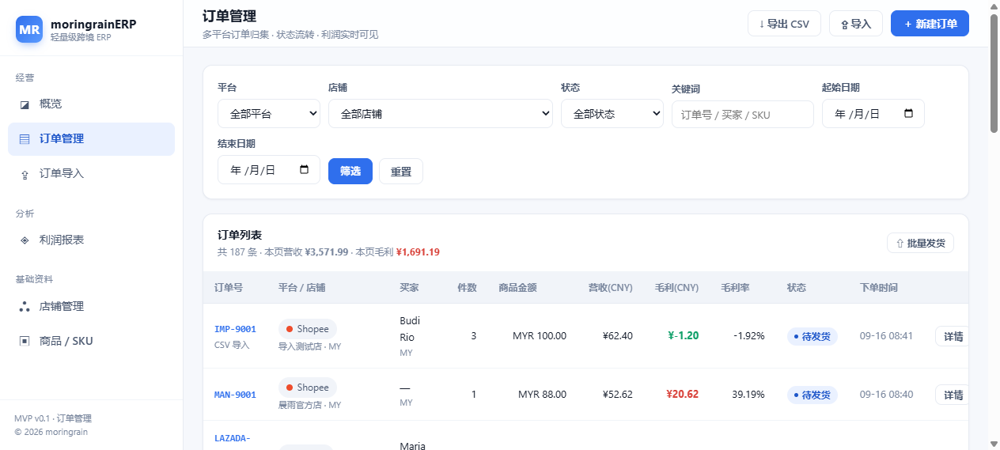
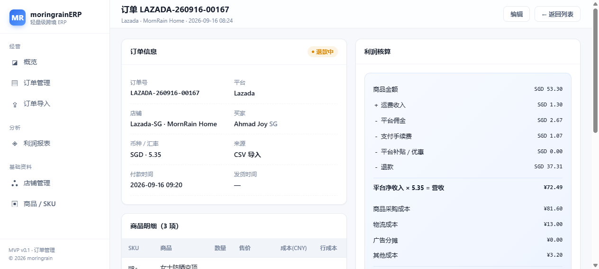
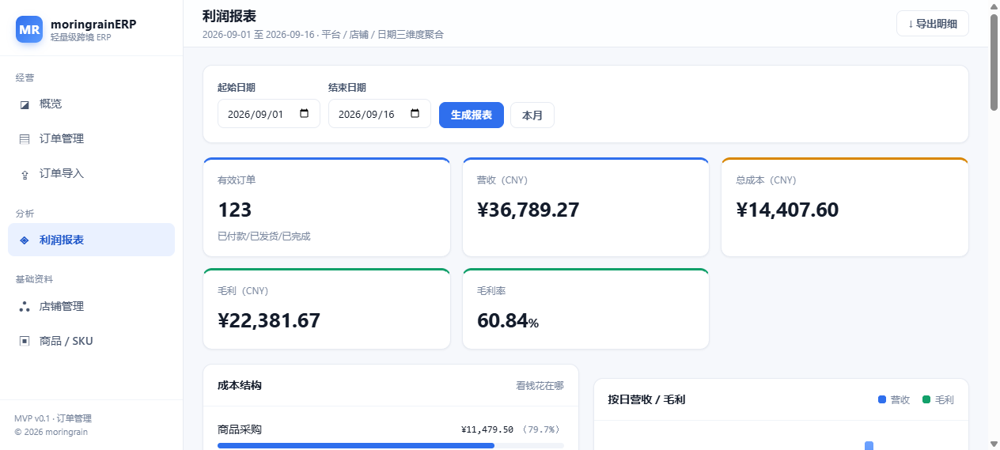

# moringrainERP

> 轻量级跨境电商 ERP · 订单管理 MVP
> 对标 [moringrain.com](https://www.moringrain.com/) 的产品定位：**让每一单利润算得清**

面向跨境电商小团队的轻量级 ERP。核心解决三件事：**多平台订单归集 → 物流发货闭环 → 自动核算利润**。
本次交付为 **订单管理 MVP**，完整跑通「拉单 → 发货 → 对账 → 算利润」主链路。

---

## 界面预览

| 经营概览 | 订单管理 |
|---|---|
|  |  |

| 订单详情（利润拆解） | 利润报表 |
|---|---|
|  |  |

---

## 一、为什么是这套设计

网站的宣传口径是：*免费版每月 400 单、对接 20+ 主流平台、自动归集平台佣金/广告费/物流成本与退款，毛利误差 2% 以内*。

这套 MVP 就是围绕这句话做的产品化落地：

| 官网卖点 | MVP 中的实现 |
|---|---|
| 对接 20+ 主流平台 | `platforms` 表预置 **21 个平台**，含默认佣金率 / 手续费率 |
| 自动归集成本 | `orders` 表拆分平台币 / 人民币两类字段，佣金·手续费·物流·广告·退款逐项落表 |
| 毛利误差 ≤2% | `ProfitCalculator` 统一口径计算，全部折算为 CNY，杜绝手工心算 |
| 多店铺 | `shops` 表支持「一个平台多店铺多站点 + 独立汇率」 |
| 400 单/月额度 | MVP 未做计费，但订单量统计已就绪，可直接加额度校验 |

---

## 二、技术栈

| 层 | 选型 | 说明 |
|---|---|---|
| 框架 | Laravel 13.32 | 与现有 Linux + Nginx + PHP 8.3 + Redis 栈一致，零额外运维 |
| 语言 | PHP 8.3.33（NTS） | 使用 `enum` 状态机、类型化属性等特性 |
| 数据库 | SQLite（开发）/ MySQL 8（生产） | 切库只需改 `.env` 的 `DB_CONNECTION` |
| 视图 | Blade + 自研本地 CSS | **不依赖任何外部 CDN**，资源全部本地化 |
| 前端增强 | 原生 JS（约 60 行） | 订单明细动态增删、费率自动试算，无构建步骤 |

> 遵从既有架构约定：零插件、资源本地化、不引入 Elementor / Divi 类重前端。

---

## 三、目录结构

```
moringrainerp/
├── app/
│   ├── Enums/
│   │   ├── OrderStatus.php          # 订单状态机（含流转规则、UI 配色）
│   │   └── ShipmentStatus.php       # 物流状态
│   ├── Http/Controllers/
│   │   ├── DashboardController.php  # 经营概览
│   │   ├── OrderController.php      # 订单 CRUD / 状态流转 / 发货 / 导入导出 / 模拟同步
│   │   ├── ShopController.php       # 店铺管理
│   │   ├── ProductController.php    # 商品 SKU 管理
│   │   └── ReportController.php     # 利润报表
│   ├── Models/                      # Platform / Shop / Product / Order / OrderItem / Shipment
│   └── Support/ProfitCalculator.php # 利润核算核心
├── database/
│   ├── migrations/                  # 6 张业务表
│   └── seeders/                     # PlatformSeeder + DemoDataSeeder
├── public/css/app.css               # 本地后台样式（自研）
├── resources/views/                 # layouts / dashboard / orders / shops / products / reports
└── routes/web.php
```

---

## 四、数据模型（ER）

```
platforms (平台)
   │ 1
   │ n
shops (店铺) ── 独立币种 + 汇率
   │ 1
   │ n
orders (订单) ──┬── n order_items (明细) ── n→1 products (SKU / 采购成本)
                │
                └── n shipments (物流 / 发货)
```

### 订单表的金额口径（关键设计）

跨境 ERP 最容易算错利润的地方，就是**币种混用**。本设计把字段按口径硬隔离：

| 口径 | 字段 | 含义 |
|---|---|---|
| **平台币** | `goods_amount` / `shipping_income` / `discount_amount` / `platform_commission` / `payment_fee` / `refund_amount` | 平台后台看到的数字 |
| **人民币** | `shipping_cost` / `ad_cost` / `other_cost` | 卖家在国内实际掏的钱 |
| **换算** | `exchange_rate` | 平台币 → CNY 的桥 |

明细表冗余存储 `line_total`（售价小计）与 `line_cost`（成本小计），列表页用 `withSum` 聚合，**避免 N+1**。

---

## 五、利润核算公式

`app/Support/ProfitCalculator.php` 是唯一计算入口，全站统一调用：

```
平台净收入 = 商品金额 + 运费收入 − 平台补贴 − 平台佣金 − 支付手续费 − 退款
营收(CNY)  = 平台净收入 × 汇率
成本(CNY)  = 商品采购成本 + 物流成本 + 广告分摊 + 其他成本
毛利(CNY)  = 营收 − 成本
毛利率     = 毛利 ÷ 营收 × 100%
```

其中 `商品采购成本 = Σ(明细 unit_cost × quantity)`，`unit_cost` 在落单时从商品库快照，**历史调价不会污染旧订单**。

---

## 六、功能清单

### 1. 经营概览 `/`
- 今日 / 本月订单数、营收、毛利、毛利率
- 待发货数、退款中数量预警
- 近 7 日营收 / 毛利双柱趋势
- 本月各平台营收占比条
- 待发货订单、最新订单速览（带实时毛利）

### 2. 订单管理 `/orders`
- **多维筛选**：平台 / 店铺 / 状态 / 关键词（订单号·买家·SKU）/ 日期区间
- 列表实时显示每单营收、毛利、毛利率；底部汇总本页合计
- **状态流转**：待付款 → 待发货 → 已发货 → 已完成；支持退款中 / 已退款 / 已取消，非法流转会被拦截
- **单条发货**：填物流商 + 运单号，自动生成物流记录并推进状态
- **批量发货**：粘贴「订单号,运单号」多行，一次处理，失败行单独回报
- **CSV 导入**：同一订单号多行自动合并为一张订单 + 多条明细；平台按 code 匹配，店铺不存在自动创建
- **CSV 导出**：带 BOM 中文表头，Excel 直接打开不乱码，含利润核算结果列
- **模拟平台同步**：一键拉取 N 笔随机订单，演示 API 拉单链路（真实环境替换为各平台 OpenAPI）

### 3. 订单详情 `/orders/{id}`
- 订单信息、商品明细、物流记录三段式布局
- **利润核算面板**：从商品金额一路减到毛利，每一步都摊开给用户看

### 4. 利润报表 `/reports/profit`
- 任意日期区间，三维聚合：**按平台 / 按店铺 / 按日**
- 成本结构拆解（商品采购 / 物流 / 广告 / 其他）
- **亏损订单预警 Top 8**
- **SKU 毛利贡献 Top 10**

### 5. 基础资料
- 店铺管理 `/shops`：平台归属、站点、币种、汇率
- 商品 SKU `/products`：采购成本、重量、品类（成本是利润的输入项）

---

## 七、本地运行

本项目已在本机装好**隔离的 PHP 运行环境**，开箱即用：

```
PHP 运行时：C:\Users\linga\.workbuddy\binaries\php\8.3.33\php.exe
Composer  ：C:\Users\linga\.workbuddy\binaries\composer\composer.phar
```

> 通用环境要求：PHP ≥ 8.3（需 `pdo_sqlite` / `mbstring` / `openssl` / `fileinfo` / `curl` / `zip` 扩展）+ Composer 2。
> 上述本机路径可用你自己的 `php` / `composer` 命令替代。

启动：

```bash
cd moringrainerp

# 首次：建库 + 迁移 + 灌演示数据（180 张订单 + 355 条明细 + 70 条物流）
php artisan migrate --force
php artisan db:seed --force

# 启动开发服务器
php artisan serve --host=127.0.0.1 --port=8000
```

访问 <http://127.0.0.1:8000>

> 提示：Windows 下 PHP 必须显式配置 `upload_tmp_dir`，否则文件上传会报
> `unable to create a temporary file`。本机 php.ini 已配好。

---

## 八、生产部署建议

沿用现有服务器架构（Linux + Nginx + PHP 8.3 + Redis）：

```bash
# 1) 切 MySQL（.env）
DB_CONNECTION=mysql
DB_HOST=127.0.0.1
DB_DATABASE=moringrainerp
DB_USERNAME=xxx
DB_PASSWORD=xxx

# 2) 缓存 / 会话 / 队列切 Redis
CACHE_STORE=redis
SESSION_DRIVER=redis
QUEUE_CONNECTION=redis

# 3) 上线
composer install --no-dev --optimize-autoloader
php artisan migrate --force
php artisan config:cache && php artisan route:cache && php artisan view:cache
```

Nginx 站点根指向 `public/`，并按 Laravel 标准配置：
`try_files $uri $uri/ /index.php?$query_string;`

---

## 九、后续路线图

| 优先级 | 模块 | 说明 |
|---|---|---|
| P0 | 平台 OpenAPI 对接 | 替换「模拟同步」，接 Shopee / Lazada / TikTok Shop 官方接口自动拉单 |
| P0 | 登录与权限 | 多坐席、角色（老板 / 运营 / 客服）、操作审计 |
| P1 | 库存管理 | SKU 库存、多仓、库存同步与低库存预警 |
| P1 | 采购管理 | 补货建议、采购单、供应商 |
| P1 | 免费版额度控制 | 400 单/月限制 + 升级引导（对标官网商业化路径） |
| P2 | 广告费自动归集 | 对接平台广告 API，替代手工分摊 |
| P2 | 定时任务 | 每小时自动拉单、物流轨迹回写 |
| P2 | 看板增强 | 环比同比、SKU 维度趋势、汇率波动影响 |

---

## 十、已验证项

- 全部 9 个路由返回 200
- 状态流转：`paid → shipped` 成功，非法流转被拦截
- 单条发货 / 批量发货：写入物流记录并推进状态
- CSV 导入：2 行合并为 1 单 + 2 明细，店铺自动创建
- CSV 导出：28KB，中文表头无乱码，利润列计算正确
- 模拟同步：订单数 180 → 185
- 利润核算抽样：`revenue=350.57 / cost=126.80 / profit=223.77 / margin=63.83%`
