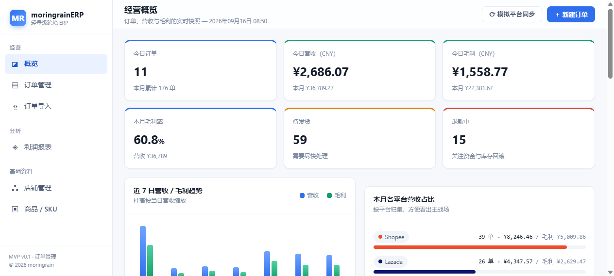
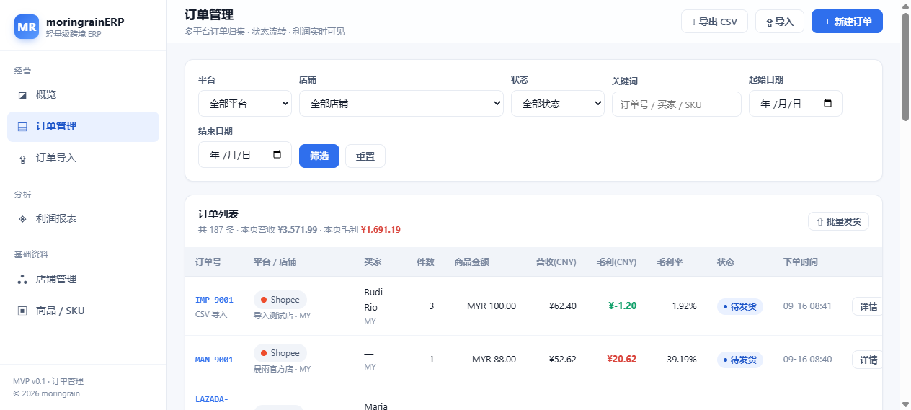
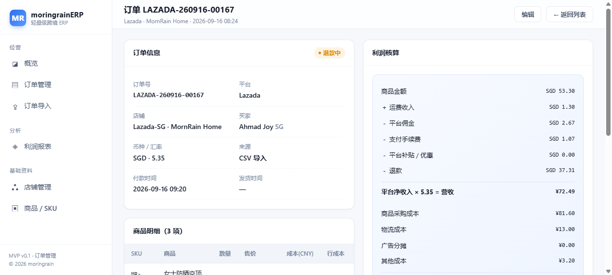
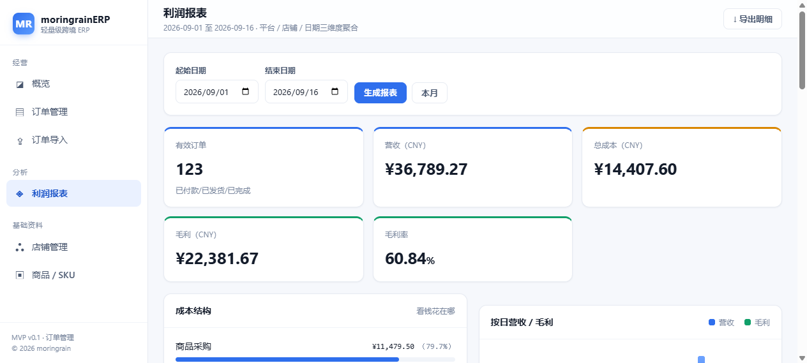

# mornrainERP

> 轻量级跨境电商 ERP · 订单 / 库存 / 利润 / 平台对接（v0.5）
> 对标 [moringrain.com](https://www.moringrain.com/) 的产品定位：**让每一单利润算得清**

面向跨境电商小团队的轻量级 ERP。核心解决四件事：**多平台订单归集 → 库存与发货闭环 → 自动核算利润 → 团队协同**。
当前版本跑通「登录 → 拉单/录单 → 发货扣库存 → 对账 → 算利润 → 补货建议」主链路。

---

## 界面预览

| 经营概览 | 订单管理 |
|---|---|
|  |  |

| 订单详情（利润拆解） | 利润报表 |
|---|---|
|  |  |

---

## 一、为什么是这套设计

网站的宣传口径是：*免费版每月 400 单、对接 20+ 主流平台、自动归集平台佣金/广告费/物流成本与退款，毛利误差 2% 以内*。

这套 MVP 就是围绕这句话做的产品化落地：

| 官网卖点 | MVP 中的实现 |
|---|---|
| 对接 20+ 主流平台 | `platforms` 表预置 **21 个平台**，含默认佣金率 / 手续费率 |
| 自动归集成本 | `orders` 表拆分平台币 / 人民币两类字段，佣金·手续费·物流·广告·退款逐项落表 |
| 毛利误差 ≤2% | `ProfitCalculator` 统一口径计算，全部折算为 CNY，杜绝手工心算 |
| 多店铺 | `shops` 表支持「一个平台多店铺多站点 + 独立汇率」 |
| 400 单/月额度 | `QuotaService` 按自然月统计新建订单，免费版超 400 单阻断新建并引导升级 |

---

## 二、技术栈

| 层 | 选型 | 说明 |
|---|---|---|
| 框架 | Laravel 13.32 | 与现有 Linux + Nginx + PHP 8.3 + Redis 栈一致，零额外运维 |
| 语言 | PHP 8.3.33（NTS） | 使用 `enum` 状态机、类型化属性等特性 |
| 数据库 | SQLite（开发）/ MySQL 8（生产） | 切库只需改 `.env` 的 `DB_CONNECTION` |
| 视图 | Blade + 自研本地 CSS | **不依赖任何外部 CDN**，资源全部本地化 |
| 前端增强 | 原生 JS（约 60 行） | 订单明细动态增删、费率自动试算，无构建步骤 |

> 遵从既有架构约定：零插件、资源本地化、不引入 Elementor / Divi 类重前端。

---

## 三、目录结构

```
mornrainerp/
├── app/
│   ├── Enums/
│   │   ├── OrderStatus.php          # 订单状态机（含流转规则、UI 配色）
│   │   ├── ShipmentStatus.php       # 物流状态
│   │   └── POStatus.php             # 采购单状态机（草稿/已下单/已收货/已取消）
│   ├── Http/Controllers/
│   │   ├── AuthController.php       # 登录 / 登出 / 修改密码
│   │   ├── DashboardController.php  # 经营概览（含环比、库存预警、额度与广告费）
│   │   ├── InventoryController.php  # 库存总览 / 采购建议 / 入库出库盘点
│   │   ├── OrderController.php      # 订单 CRUD / 状态流转 / 发货（扣库存）/ 导入导出
│   │   ├── ProductController.php    # 商品 SKU 管理
│   │   ├── PurchaseController.php   # 采购单 CRUD / 收货入库 / 按建议生成
│   │   ├── ReportController.php     # 利润报表 + 利润明细导出 + 广告费归集
│   │   ├── ShipmentController.php   # 物流轨迹刷新（单条 / 全部在途）
│   │   ├── ShopController.php       # 店铺管理
│   │   ├── SyncController.php       # 平台对接（凭证配置 / 手动拉单）
│   │   └── UserController.php       # 账号管理（仅管理员）
│   ├── Http/Middleware/
│   │   ├── Authenticate.php         # 未登录跳登录页并记住目标地址
│   │   └── EnsureAdmin.php          # 管理员闸门
│   ├── Models/                      # User / Platform / Shop / Product / Order /
│   │                                # OrderItem / Shipment / SyncLog / StockMovement /
│   │                                # Supplier / PurchaseOrder / PurchaseOrderItem
│   ├── Services/
│   │   ├── Inventory/StockService.php          # 库存唯一出入口 + 采购建议
│   │   ├── Logistics/                            # 物流轨迹回写
│   │   │   ├── CarrierTracker.php               # 轨迹接口
│   │   │   ├── MockCarrierTracker.php           # 演示轨迹生成器
│   │   │   └── TrackingService.php              # 拉取 → 回写 events → 推进签收
│   │   ├── PlatformSync/                       # 平台拉单适配层
│   │   │   ├── PlatformConnector.php           # 连接器契约
│   │   │   ├── GenericRestConnector.php        # 通用 REST OpenAPI 实现
│   │   │   ├── PlatformConnectorFactory.php    # 按平台注册连接器
│   │   │   ├── NormalizedOrder.php             # 平台订单标准形态
│   │   │   └── OrderSyncService.php            # 拉单 → 去重落库 → 写同步日志
│   │   └── Quota/                              # 免费版额度控制
│   │       ├── QuotaService.php                # 月度新建订单额度
│   │       └── QuotaExceededException.php      # 超额异常
│   └── Support/ProfitCalculator.php # 利润核算核心
├── app/Console/Commands/SyncOrders.php     # php artisan orders:sync（可挂定时）
├── app/Console/Commands/TrackShipments.php # php artisan shipments:track（可挂定时）
├── config/plan.php                          # 套餐与额度（ERP_PLAN / ERP_FREE_QUOTA）
├── database/
│   ├── migrations/                  # 13 张表（含 suppliers / purchase_orders /
│   │                                #   purchase_order_items / shipments 轨迹字段）
│   └── seeders/                     # AdminUser + Platform + Supplier + DemoData + Inventory
├── public/css/app.css               # 本地后台样式（自研，含额度条与物流时间线）
├── resources/views/                 # layouts / dashboard / orders / inventory / sync /
│                                    # shops / products / reports / users / auth / purchases
└── routes/
    ├── web.php                      # 后台路由（auth / admin 中间件）
    └── console.php                  # 定时拉单 + 每日 08:00 物流轨迹刷新开关
```

---

## 四、数据模型（ER）

```
platforms (平台)
   │ 1
   │ n
shops (店铺) ── 独立币种 + 汇率 + OpenAPI 凭证（AppSecret 加密存储）
   │ 1
   │ n
orders (订单) ──┬── n order_items (明细) ── n→1 products (SKU / 采购成本 / 库存)
                │                                    │ 1
                │                                    │ n
                │                              stock_movements (库存流水)
                └── n shipments (物流 / 发货)

users (账号 admin/staff) ── 操作人，写入库存流水
sync_logs (同步日志) ── n→1 shops

suppliers (供应商) ── 1 n ── purchase_orders (采购单) ── n purchase_order_items
purchase_orders ── n→1 shops(created_by: users)
purchase_order_items ── n→1 products   # 收货时按明细回写库存
```

> 采购入库：收货时 `StockService::adjust(product, qty, 'po_in')` 写入 `stock_movements`，
> `type='po_in'` 标记为「采购入库」，与销售出库（`out`）共用同一条流水。

### 订单表的金额口径（关键设计）

跨境 ERP 最容易算错利润的地方，就是**币种混用**。本设计把字段按口径硬隔离：

| 口径 | 字段 | 含义 |
|---|---|---|
| **平台币** | `goods_amount` / `shipping_income` / `discount_amount` / `platform_commission` / `payment_fee` / `refund_amount` | 平台后台看到的数字 |
| **人民币** | `shipping_cost` / `ad_cost` / `other_cost` | 卖家在国内实际掏的钱 |
| **换算** | `exchange_rate` | 平台币 → CNY 的桥 |

明细表冗余存储 `line_total`（售价小计）与 `line_cost`（成本小计），列表页用 `withSum` 聚合，**避免 N+1**。

---

## 五、利润核算公式

`app/Support/ProfitCalculator.php` 是唯一计算入口，全站统一调用：

```
平台净收入 = 商品金额 + 运费收入 − 平台补贴 − 平台佣金 − 支付手续费 − 退款
营收(CNY)  = 平台净收入 × 汇率
成本(CNY)  = 商品采购成本 + 物流成本 + 广告分摊 + 其他成本
毛利(CNY)  = 营收 − 成本
毛利率     = 毛利 ÷ 营收 × 100%
```

其中 `商品采购成本 = Σ(明细 unit_cost × quantity)`，`unit_cost` 在落单时从商品库快照，**历史调价不会污染旧订单**。

---

## 六、功能清单

### 1. 经营概览 `/`
- 今日 / 本月订单数、营收、毛利、毛利率
- **环比**：今日 vs 昨日、本月 vs 上月同期（涨红跌绿，基期为 0 显示 —）
- 待发货数、退款中数量预警
- **近 14 日**营收 / 毛利双柱趋势
- 本月各平台营收占比条（含各平台毛利率）
- **低库存预警条**：低于安全库存的 SKU 直接列出，可一键跳补货
- 待发货订单、最新订单速览（带实时毛利）

### 2. 订单管理 `/orders`
- **多维筛选**：平台 / 店铺 / 状态 / 关键词（订单号·买家·SKU）/ 日期区间
- 列表实时显示每单营收、毛利、毛利率；底部汇总本页合计
- **状态流转**：待付款 → 待发货 → 已发货 → 已完成；支持退款中 / 已退款 / 已取消，非法流转会被拦截
- **单条发货**：填物流商 + 运单号，自动生成物流记录、推进状态并**按明细扣减库存**
- **批量发货**：粘贴「订单号,运单号」多行，一次处理，失败行单独回报（同样扣库存）
- **退款完成自动回补库存**：状态流转到「已退款」时把发货时扣掉的库存还回去
- **CSV 导入**：同一订单号多行自动合并为一张订单 + 多条明细；平台按 code 匹配，店铺不存在自动创建
- **CSV 导出**：带 BOM 中文表头，Excel 直接打开不乱码，含利润核算结果列

### 3. 订单详情 `/orders/{id}`
- 订单信息、商品明细、物流记录三段式布局
- **利润核算面板**：从商品金额一路减到毛利，每一步都摊开给用户看

### 4. 利润报表 `/reports/profit`
- 任意日期区间，三维聚合：**按平台 / 按店铺 / 按日**
- 成本结构拆解（商品采购 / 物流 / 广告 / 其他）
- **亏损订单预警 Top 8**
- **SKU 毛利贡献 Top 10**
- **导出**：利润明细 CSV（营收 / 四项成本 / 毛利 / 毛利率）与订单 CSV，均带 BOM

### 5. 库存与采购 `/inventory`
- SKU 库存总览（库存、安全库存、累计销量、库存货值）
- **入库 / 出库 / 盘点**三种调整方式，每次变动写入 `stock_movements` 流水（含操作人）
- **低库存预警**：低于安全库存标黄、≤0 标红
- **采购建议**：`建议补货量 = 近 30 天销量 + 安全库存 − 当前库存`，并给出预估采购额
- 发货自动出库、退款完成自动回补，允许负库存（超卖要被看见，不悄悄抹平）

### 6. 平台对接 `/sync`（管理员）
- 店铺级 OpenAPI 凭证配置：`api_base` / `app_key` / `app_secret`
  - **AppSecret 加密落库**（Eloquent `encrypted` cast），页面永不回显
- **通用 REST 连接器**：`GET {api_base}/orders`，签名头
  `X-Signature = HMAC-SHA256(app_key + "\n" + timestamp + "\n" + "/orders", app_secret)`
- **自动去重**：按 `shop_id + order_no` upsert，明细按 SKU 更新，平台删掉的行同步清理
- **成本快照**：明细 `unit_cost` 落单时取商品库成本，历史调价不影响旧订单
- **同步日志**：每次拉单记录时间窗、拉取/新建/更新数、耗时与失败原因
- **手动 + 定时**双通道：页面点「立即同步」，命令行 `php artisan orders:sync --all`
  （`.env` 设 `SYNC_SCHEDULE_ENABLED=true` 后由 `schedule:run` 每小时执行）
- 新增平台只需实现 `PlatformConnector` 接口并在工厂注册，落库逻辑零改动

### 7. 登录与权限
- 全站后台强制登录（`/login`、`/logout` 除外），未登录自动跳登录页并记住目标地址
- 两级角色：**管理员**（店铺 / 商品 / 平台对接 / 账号管理）/ **运营**（订单与报表）
- 登录失败统一文案（不暴露账号是否存在），登录接口按 IP 限流 10 次/分钟
- 个人可自助改密码；管理员可建号、重置密码、停用 / 删除账号（不能操作自己）

### 8. 基础资料
- 店铺管理 `/shops`：平台归属、站点、币种、汇率
- 商品 SKU `/products`：采购成本、重量、品类、**当前库存与安全库存**（成本是利润的输入项）

### 9. 免费版额度控制 `/`（概览）
- 套餐与额度由 `config/plan.php` 驱动（`ERP_PLAN` 默认 `free`，`ERP_FREE_QUOTA` 默认 `400`，设 `0` 为不限量）
- `QuotaService` 按 `orders.created_at` 自然月统计**新建**订单数，`remaining()` 不限量返 `null`
- 拦截点：手工录单（`OrderController::store`）、CSV 导入（`OrderController::import` 按去重后的净新增数校验）、平台拉单（`OrderSyncService` 在额度耗尽时跳过新建并计入 `skipped`/`blocked`）
- 超额时统一抛 `QuotaExceededException`，页面提示「本月订单额度已用完（已用/额度）。升级付费版可解除限制，或等待下月 1 日自动重置。」
- 概览页「本月订单额度」进度条：已用/限制、剩余数、`pct≥100` 标红

### 10. 采购单与供应商 `/purchases`（管理员）
- **供应商**：`suppliers` 表（名称/联系人/电话/邮箱/地址/备注/是否启用），`SupplierSeeder` 空库写入 2 个演示供应商
- **采购单**：`purchase_orders` + 明细 `purchase_order_items`，状态机 `POStatus`（草稿→已下单→已收货→已取消），`recalcTotal()` 自动汇总行小计
- **收货入库**：`receive()` 在事务内对每条明细调用 `StockService::adjust(..., StockMovement::TYPE_PO_IN, ...)`，库存回写、流水类型标记为「采购入库」，PO 置已收货并写 `received_at`
- **一键补货**：库存页「采购建议」可一键 `POST /purchases/from-suggestions` 生成草稿采购单（自动汇总所有低于安全库存的 SKU 预估采购额）
- 列表/详情均按 `canReceive()` 控制是否展示收货入口

### 11. 广告费自动归集 `/reports/profit`
- 利润公式已含 `广告分摊` 口径；本次在利润报表与概览补充**广告费聚合视图**
- 报表页新增三块 KPI：**广告费（CNY）**、`广告费占比 = 广告费 ÷ 营收`、`ROAS = 营收 ÷ 广告费`（广告费为 0 时 ROAS 显示 —）
- 概览页新增「本月广告费」与占比，便于运营监控投放效率
- 归集数据来自 `orders.ad_cost`（人民币口径，落单时录入），无需手工分摊

### 12. 物流轨迹回写 `/orders/{id}`
- 抽象 `CarrierTracker` 接口 + `MockCarrierTracker`（演示用，按 `shipped_at` 推算跨境 5 节点：揽收 → 运输中 → 到达目的国 → 派送中 → 已签收）
- `TrackingService` 拉取轨迹后回写 `shipments.events` / `last_tracked_at`；末节点含「签收」则自动把 `status` 推进 `delivered` 并写 `delivered_at`
- 页面入口：订单详情「批量刷新在途物流」按钮 + 每条运单「刷新」按钮，运单下方渲染 `<ul class="timeline">` 轨迹时间线
- 定时：`php artisan shipments:track`（刷新全部在途），`SYNC_SCHEDULE_ENABLED=true` 时由 `schedule:run` 每日 08:00 执行

> 接入真实物流商只需实现 `CarrierTracker` 接口并在 `AppServiceProvider` 重新 `bind` 即可，其余逻辑零改动。

---

## 七、本地运行

本项目已在本机装好**隔离的 PHP 运行环境**，开箱即用：

```
PHP 运行时：C:\Users\linga\.workbuddy\binaries\php\8.3.33\php.exe
Composer  ：C:\Users\linga\.workbuddy\binaries\composer\composer.phar
```

> 通用环境要求：PHP ≥ 8.3（需 `pdo_sqlite` / `mbstring` / `openssl` / `fileinfo` / `curl` / `zip` 扩展）+ Composer 2。
> 上述本机路径可用你自己的 `php` / `composer` 命令替代。

启动：

```bash
cd mornrainerp

# 0) 环境配置：复制 .env 并生成 APP_KEY
cp .env.example .env
php artisan key:generate

#    在 .env 里设置初始管理员（不设置则 db:seed 跳过建号，页面将无法登录）
INIT_ADMIN_EMAIL=admin@mornrain.local
INIT_ADMIN_PASSWORD=********      # 至少 8 位，建议上线后立即修改

# 1) 建库 + 迁移 + 灌演示数据（180 张订单 + 355 条明细 + 70 条物流 + 12 个 SKU 库存）
php artisan migrate --force
php artisan db:seed --force

# 2) 启动开发服务器
php artisan serve --host=127.0.0.1 --port=8000
```

访问 <http://127.0.0.1:8000>，会先跳登录页。

> **演示账号**（仅本地演示用，生产环境务必改掉）
> | 角色 | 邮箱 | 密码 |
> |---|---|---|
> | 管理员 | `admin@mornrain.local` | `.env` 里的 `INIT_ADMIN_PASSWORD` |
> | 运营 | 由管理员在「账号管理」创建 | 创建时设置 |
>
> 运营账号只能看概览与订单，访问基础资料 / 平台对接 / 账号管理会返回 403。

> 提示：Windows 下 PHP 必须显式配置 `upload_tmp_dir`，否则文件上传会报
> `unable to create a temporary file`。本机 php.ini 已配好。

---

## 八、生产部署建议

沿用现有服务器架构（Linux + Nginx + PHP 8.3 + Redis）：

```bash
# 1) 切 MySQL（.env）
DB_CONNECTION=mysql
DB_HOST=127.0.0.1
DB_DATABASE=mornrainerp
DB_USERNAME=xxx
DB_PASSWORD=xxx

# 2) 缓存 / 会话切 Redis
#    任务为同步执行（QUEUE_CONNECTION=sync），当前未启用异步队列
CACHE_STORE=redis
SESSION_DRIVER=redis

# 3) 上线
composer install --no-dev --optimize-autoloader
php artisan migrate --force
php artisan config:cache && php artisan route:cache && php artisan view:cache
```

Nginx 站点根指向 `public/`，并按 Laravel 标准配置：
`try_files $uri $uri/ /index.php?$query_string;`

---

## 九、后续路线图

| 优先级 | 模块 | 状态 | 说明 |
|---|---|---|---|
| P0 | 平台 OpenAPI 对接 | ✅ 已交付 | 通用 REST 连接器 + 手动 / 定时拉单；接具体平台只需新增连接器实现 |
| P0 | 登录与权限 | ✅ 已交付 | 全站登录校验 + 管理员 / 运营两级角色 |
| P1 | 库存管理 | ✅ 已交付 | SKU 库存、安全库存、流水、发货扣减、退款回补 |
| P1 | 采购管理 | ✅ 已交付 | 供应商 + 采购单状态机 + 收货入库回写库存 + 一键补货 |
| P1 | 免费版额度控制 | ✅ 已交付 | 400 单/月限制 + 升级引导，覆盖录单/导入/拉单三入口 |
| P2 | 看板增强 | 🟡 部分 | 已做环比与 14 日趋势；同比、SKU 趋势、汇率影响待补 |
| P2 | 广告费自动归集 | ✅ 已交付 | 报表与概览补充广告费 / 占比 / ROAS 聚合视图 |
| P2 | 物流轨迹回写 | ✅ 已交付 | 运单轨迹同步 + 签收自动完成订单 + 每日定时刷新 |
| P2 | 操作审计 | ⬜ 待做 | 关键操作留痕（目前库存流水已记录操作人） |

---

## 十、已验证项

**v0.4（本次）**

- 登录：正确口令 302 到概览；未登录访问 `/` 302 到 `/login`
- 权限：运营账号访问 `/users`、`/shops`、`/products`、`/sync` 全部 403，概览与订单 200
- 页面：`/`、`/orders`、`/inventory`、`/sync`、`/users`、`/reports/profit`、`/password` 均 200
- 库存：入库 +10 后 SKU 库存 3 → 13，同步产生流水；发货后 MR-0005 库存 122 → 120
- 发货：订单状态流转到 `shipped` 并写入 `shipped_at`
- 平台对接：未配置凭证 → failed（缺 api_base/app_key）；配置无效地址 → failed（cURL 7），均写入 `sync_logs`
- 利润导出：CSV 带 BOM，表头与数值正确（示例 `营收 220.58 / 成本 59.7+15.4 / 毛利 145.48 / 65.95%`）

**v0.5（本次）**

- 额度：`ERP_FREE_QUOTA=1` 时 `remaining()=0`，`assertCanCreate()` 抛「本月订单额度已用完（189/1）…」；设 `0` 时 `remaining()=null`、`canCreate(999)=true`
- 采购：建 PO（MR-0001×10@5=¥50）→ 收货入库 → 库存 13→23、`po_in` 流水 1 条、PO `status=received`、明细 `received_qty=10`
- 一键补货：`POST /purchases/from-suggestions` 返回 302，`PurchaseOrder::count()` 1→2
- 广告归集：报表页显示「广告费占比」「ROAS」；概览显示月度广告费与占比
- 物流：单条 `track` 302、`events` 写入 5 节点、`status` 推进 `delivered`、`last_tracked_at` 写入；`artisan shipments:track` 刷新 29 条，delivered 75/total 76
- 全量 `php -l` LINT-OK；4 个新迁移 `migrate` 成功；`SupplierSeeder` 写入 2 条

**v0.1（基线）**

- 全部 9 个路由返回 200
- 状态流转：`paid → shipped` 成功，非法流转被拦截
- 单条发货 / 批量发货：写入物流记录并推进状态
- CSV 导入：2 行合并为 1 单 + 2 明细，店铺自动创建
- CSV 导出：28KB，中文表头无乱码，利润列计算正确
- 利润核算抽样：`revenue=350.57 / cost=126.80 / profit=223.77 / margin=63.83%`
